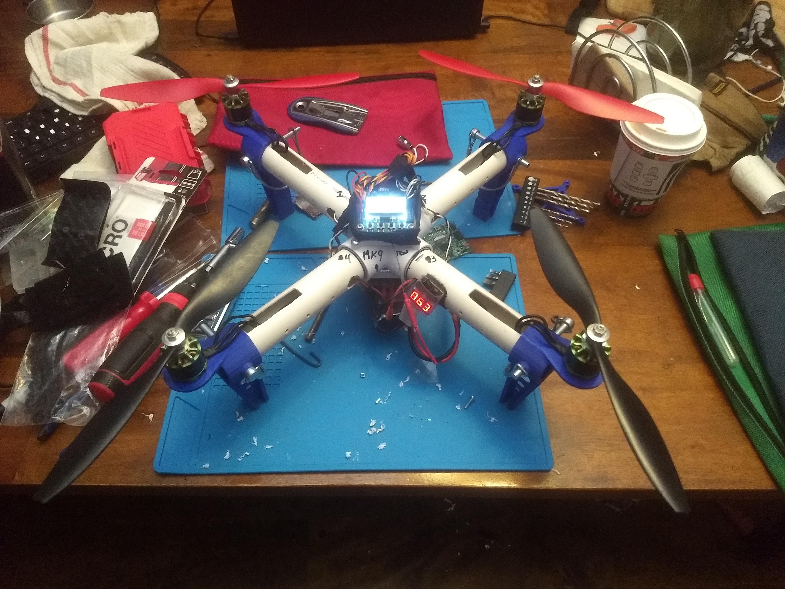
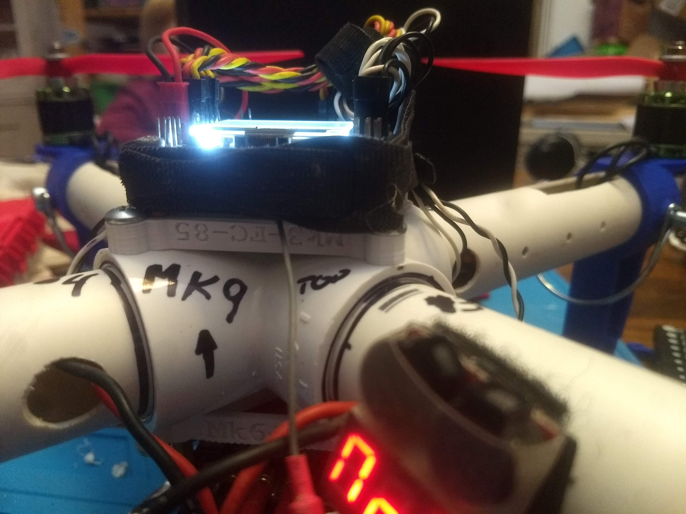

# PVC Quadcopter

These are open SCAD files for a custom quadcopter that uses 1 inch PVC pipe and fittings for some of the construction. Original inspiration for the build was taken from this [instructables](https://www.instructables.com/The-Ultimate-PVC-Quadcopter/). My original design started off very similar to the build in the link however as can be seen from the pictures below my design has evolved quite a bit. The primary changes have been to augment or replace parts with 3d printed ones. At the moment the motor mounts and landing struts are 3d printed as a single piece. The I also have now added 3d printed mounts for the flight controller and power break out board. 

This is really just a personal project I don't intend to update this repo with full build notes. If would like to use any of the parts feel free to. 

The can all be printed with out supports. I use an Anet A8 to print them so you don't need a precision machine. I primary print in PLA or PLA+ my pieces break frequently but usually after a crash that I think would warrant it, I am not a great pilot :).

